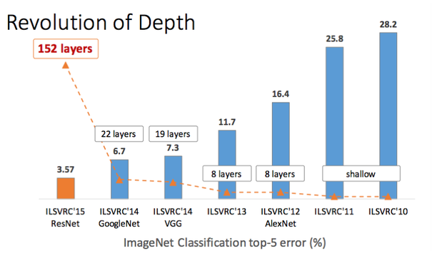

# ResNet
``` This markdown will help you understand what ResNet and provide you with the link of the referance, plus if possible then where and how to implement the ResNet in your project ``` 
ResNet is One of the best deep neural network for computer vision.

ResNet, is short for residual networks. It is classic neural network used as a backbone for many computer vision task. This model was winner of ImageNet challenge in 2015. The fundamental breakthrough with ResNet was it allowed us to train extremely deep neural networks with 150+layers successfully. Prior to ResNet training very deep neural networks was difficult due to the problem of vanishing gradients.

AlexNet, the winner of ImageNet 2012 and the model that apparently kick started the focus on deep learning had only 8 convolutional layers, the VGG network had 19 and Inception or GoogleNet had 22 layers and ResNet 152 had 152 layers. In this blog we will code a ResNet-50 that is a smaller version of ResNet 152 and frequently used as a starting point for transfer learning.



However, increasing network depth does not work by simply stacking layers together. Deep networks are hard to train because of the notorious vanishing gradient problem — as the gradient is back-propagated to earlier layers, repeated multiplication may make the gradient extremely small. As a result, as the network goes deeper, its performance gets saturated or even starts degrading rapidly.

### Skip Connection — The Strength of ResNet

ResNet first introduced the concept of skip connection. The diagram below illustrates skip connection. The figure on the left is stacking convolution layers together one after the other. On the right we still stack convolution layers as before but we now also add the original input to the output of the convolution block. This is called skip connection


